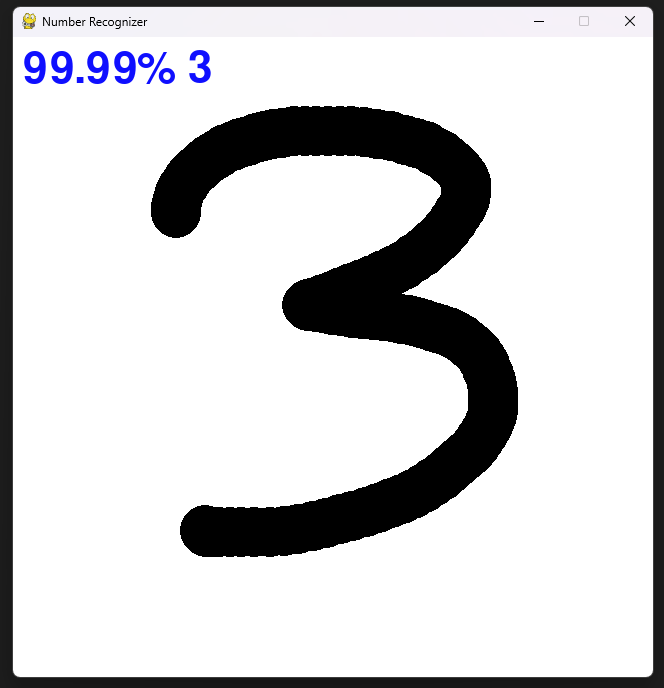

# Number Detector
This simple program lets you draw numbers and the AI will try and classify the number!

# Usage
You can use the existing `model.pth`, or train your own:
```py
py train.py
```

Then, to run the program:
```py
py main.py
```

## Improved model
View the improved CNN model on the [pytest](https://github.com/cursorweb/digit-guesser-ai-project/tree/pytest) brach.
